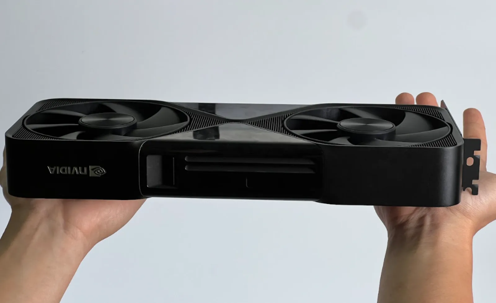
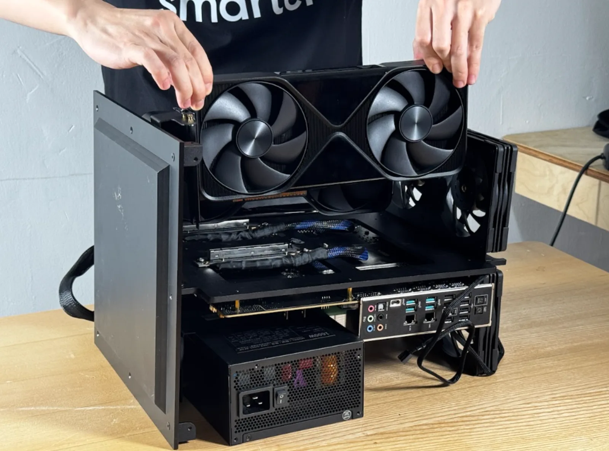
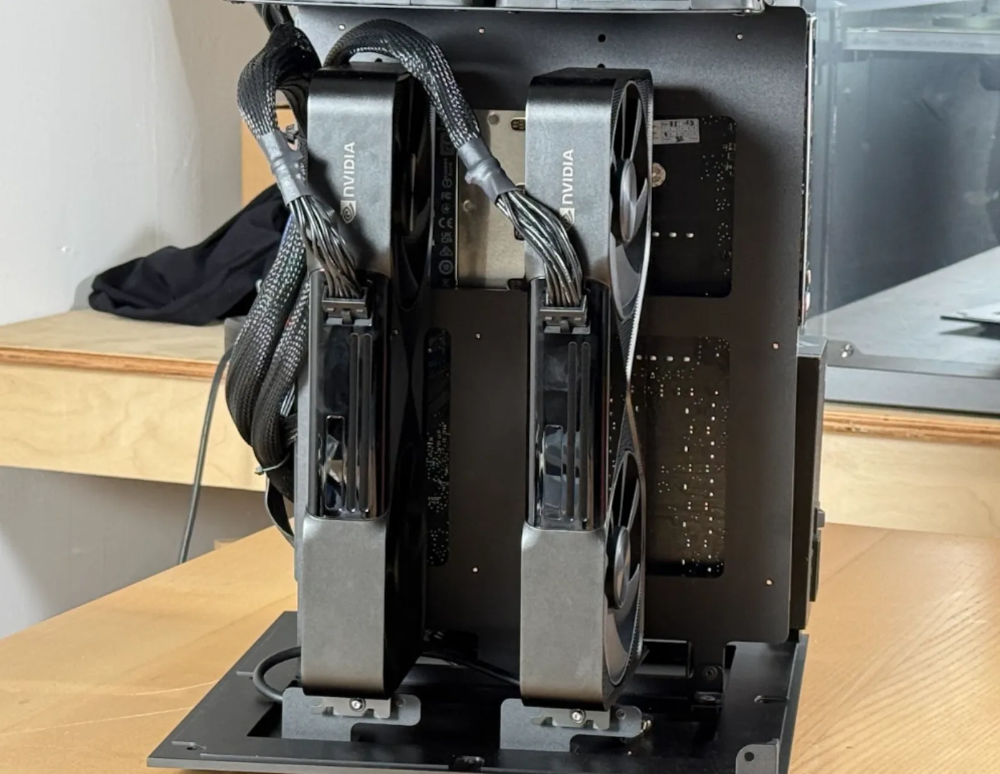
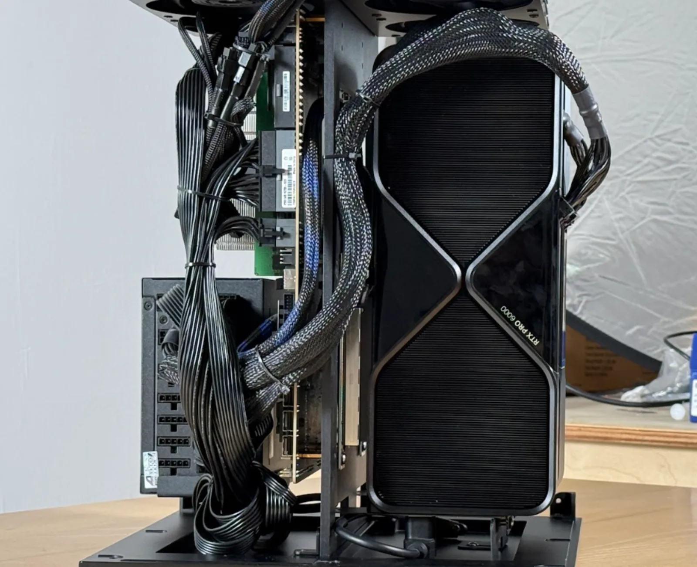
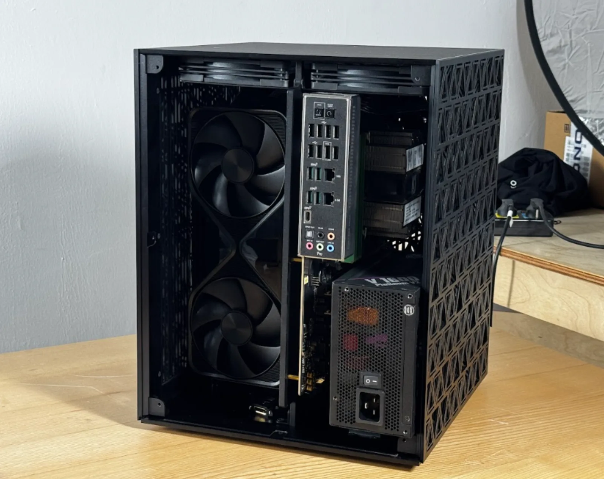
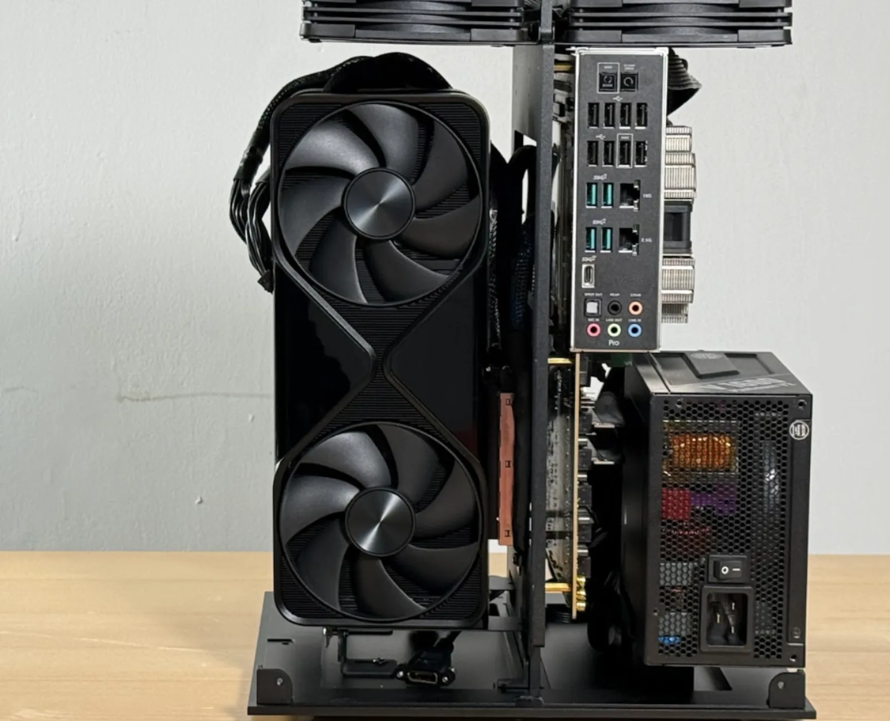
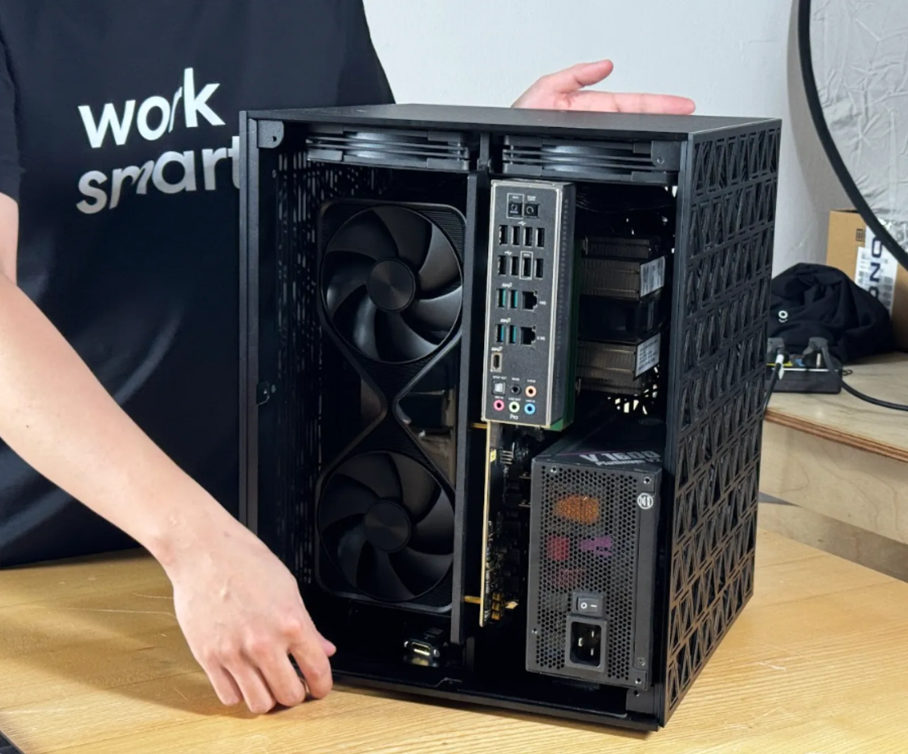

# 2× NVIDIA RTX PRO 6000

[**▶ Watch the build — two RTX PRO 6000s going in, 22 seconds**](photos/2x-6000-build.mp4) · 720p, 3.7 MB

<!--
  To turn the line above into an inline player: open a new issue on this repo,
  drag photos/2x-6000-build.mp4 into the comment box, wait for the upload to
  finish, then paste the resulting
  https://github.com/user-attachments/assets/<uuid> URL here on its own line
  (replacing the link above) and close the issue without submitting. GitHub only
  renders the player for user-attachments URLs — a repo file path always renders
  as a plain link, which is what the line above is.
-->

The workstation build: two RTX PRO 6000 Blackwell GPUs on an Intel Xeon W platform, in the same desk-sized housing as the [2× 5090](../2x-5090/README.md). 192 GB of ECC VRAM — three times the 2× 5090 in the same box, enough to run the big open models unquantized without leaving your desk.

- **2× NVIDIA RTX PRO 6000 Blackwell** — 192 GB GDDR7 ECC · 3,584 GB/s (96 GB per card)
- **Intel Xeon W5** (ASUS W790 ACE) · 96 GB RAM · 1 TB NVMe
- **PCIe Gen 5 ×16** per GPU · 10 GbE + 2.5 GbE
- **1,600 W draw** · 1,600 W PSU
- **12.5″ × 12.5″ × 16″** · 33 lb

> **Draft guide** — same housing, board, and power as the 2× 5090; only the GPUs change. The step-by-step assembly photos are from the 2× 5090 build, since the 23 steps are identical; a testing screenshot from this build is landing soon.

## Prefer a finished machine?

Building from this guide is the full DIY path. If you'd rather skip sourcing, CNC, and assembly, we have it covered — [order the 2× 6000 built](https://www.autonomous.ai/computer-2).

## Build it

1. **Parts** — the [bill of materials](bom/bom.md).
2. **Housing** — the [STL files](../2x-5090/stl-models) and the [STEP files](../2x-5090/step_models). Identical to the 2× 5090 housing, so the files live there.
3. **Lay out the electronics** — the [component checklist](docs/prepare-ee.md), with a photo of every part.
4. **Assemble** — the [photo-by-photo assembly guide](docs/assembly.md), 23 steps from bare housing to closed box.
5. **BIOS, drivers, testing** — the shared [BIOS tuning and GPU testing](../setup.md) guide. Board-specific notes below.
6. **Serve your models** — [Grid](https://github.com/autonomous-ai/autonomous-grid), the open orchestrator for local AI, or any local AI engine: vLLM, Ollama, llama.cpp.

<table>
<tr>
<td width="50%"></td>
<td width="50%"></td>
</tr>
<tr>
<td width="50%"></td>
<td width="50%"></td>
</tr>
</table>

## Why the PRO 6000 over the 5090

Same housing, same board, same wall outlet — the cards are the whole difference:

| | 2× RTX 5090 | 2× RTX PRO 6000 |
|:--|:--|:--|
| VRAM | 64 GB GDDR7 | **192 GB GDDR7 ECC** |
| Per card | 32 GB | 96 GB |
| Memory bandwidth | 3,584 GB/s | 3,584 GB/s |
| ECC | no | **yes** |

Three times the VRAM in the same box. That is the difference between quantizing a large model to make it fit and running it as released — and ECC memory means a long fine-tuning run doesn't silently corrupt.

## BIOS notes and testing

The two settings that matter on the W790 (the general list is in [the setup guide](../setup.md)):

```
Advanced -> PCI Subsystems Settings -> Enable Above 4G Decoding
Advanced -> PCI Subsystems Settings -> Enable Re-size BAR support
```

Board references: [motherboard manual](../2x-5090/docs/um-motherboard.pdf) · [BIOS manual](../2x-5090/docs/um-bios.pdf)

Then make sure both cards are detected, report full VRAM, and link at full PCIe width — the checklist is in [the setup guide](../setup.md#gpu-testing).

<!-- nvidia-smi screenshot from this build lands here. -->

## Serve your models

The rig runs, now put it to work. The easiest way is [Grid](https://github.com/autonomous-ai/autonomous-grid), the open orchestrator for local AI: it pools your machines into one local AI network. Or run any local AI engine — vLLM, Ollama, llama.cpp.

```bash
curl -fsSL https://grid.autonomous.ai/install.sh | bash
```


## The finished machine



<table>
<tr>
<td width="50%"></td>
<td width="50%"></td>
</tr>
</table>

## Other builds

The [2× 5090](../2x-5090/README.md) (the same box, 64 GB VRAM), the [4× 5090](../4x-5090/README.md) (the team build), the [4× 6000](../4x-6000/README.md) (384 GB VRAM, 5U rack), and the [8× 5090](../8x-5090/README.md) (on-prem scale) round out the family.

## License

Open source under the [MIT License](../LICENSE).
