# Preparation — Electronic & Electrical

Every part in the [bill of materials](../bom/bom.md), photographed. Lay them all out before you start assembly.

> The GPU (item 8) is photographed from this build. Every other part is shared with the 2× 5090.

<table>
    <tr>
        <td valign="top" align="center" width="50%">
            <b>1. Motherboard — ASUS W790 ACE</b> 
            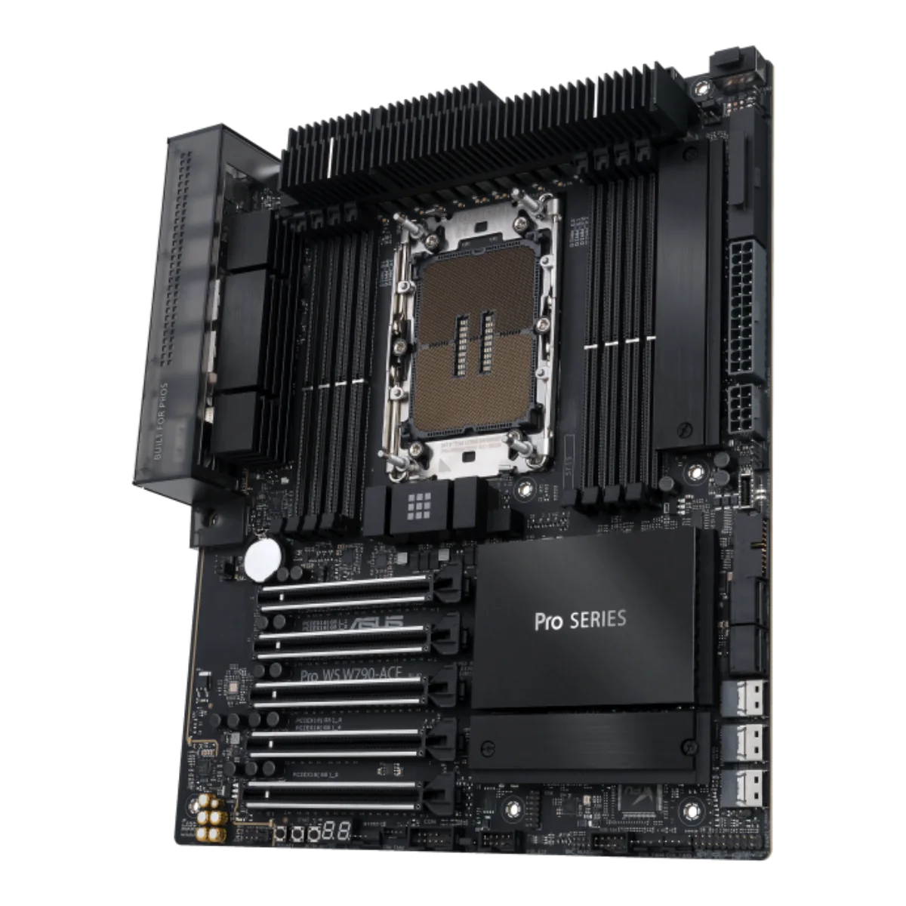 
            <b>3. CPU — Intel Xeon W5</b> 
            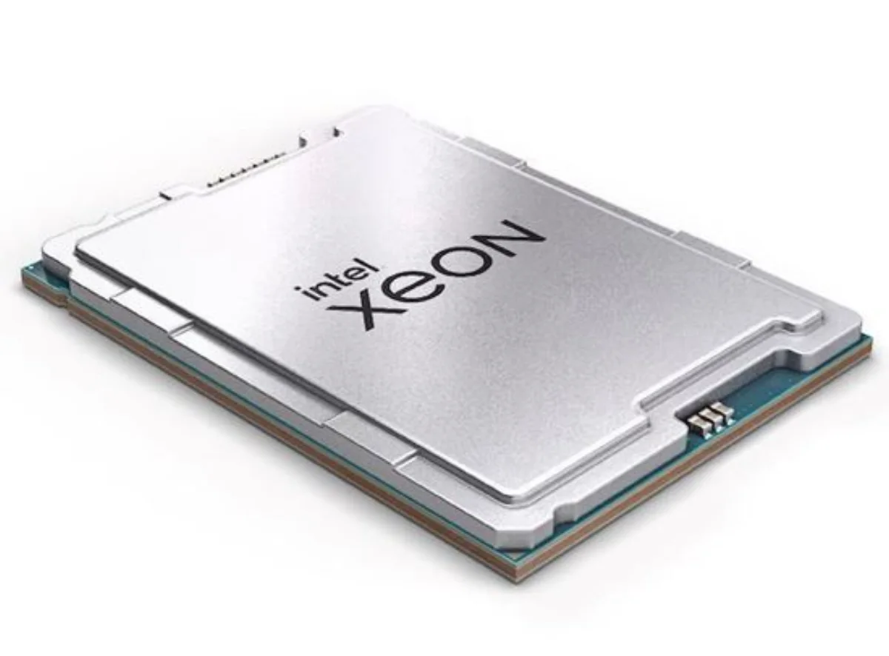 
            <b>5. SSD — NVMe 1 TB</b> 
            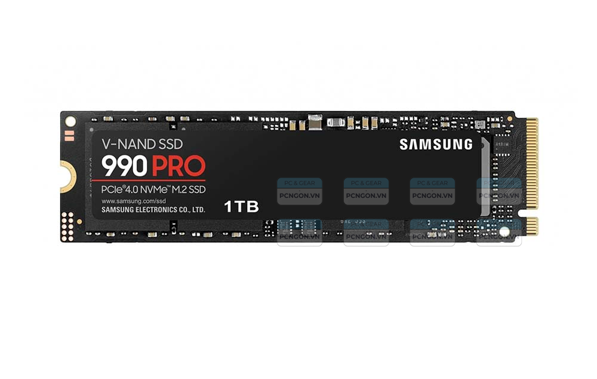 
            <b>7. RAM — DDR5 48 GB</b> 
            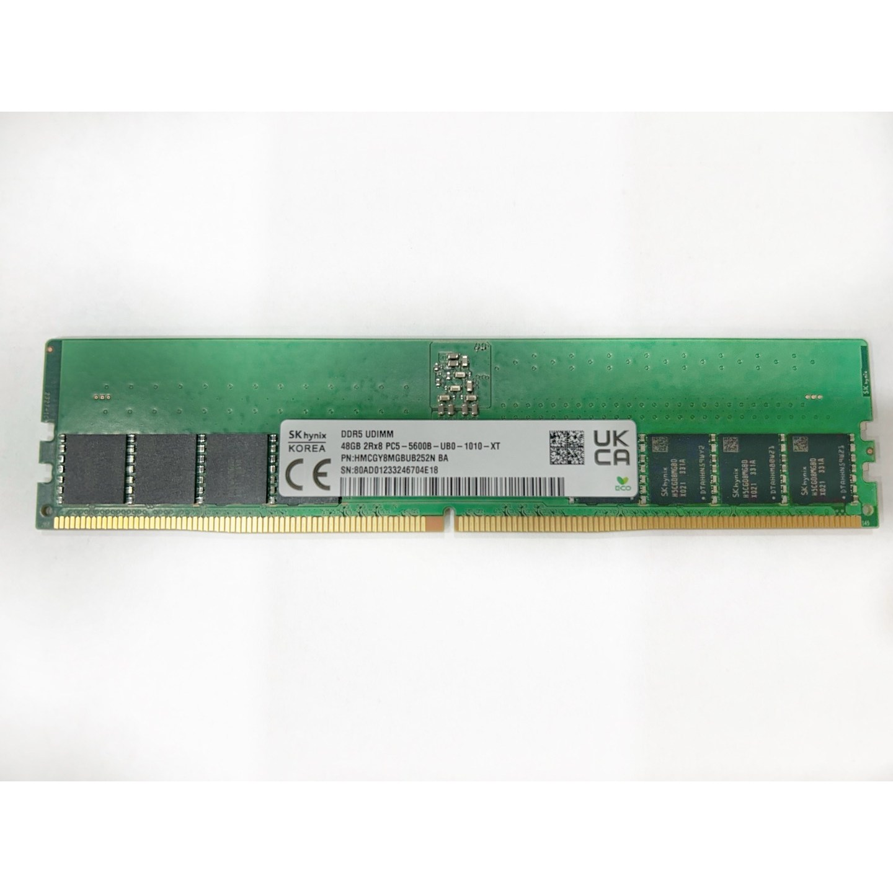 
            <b>9. PCIe 5.0 riser cable</b> 
            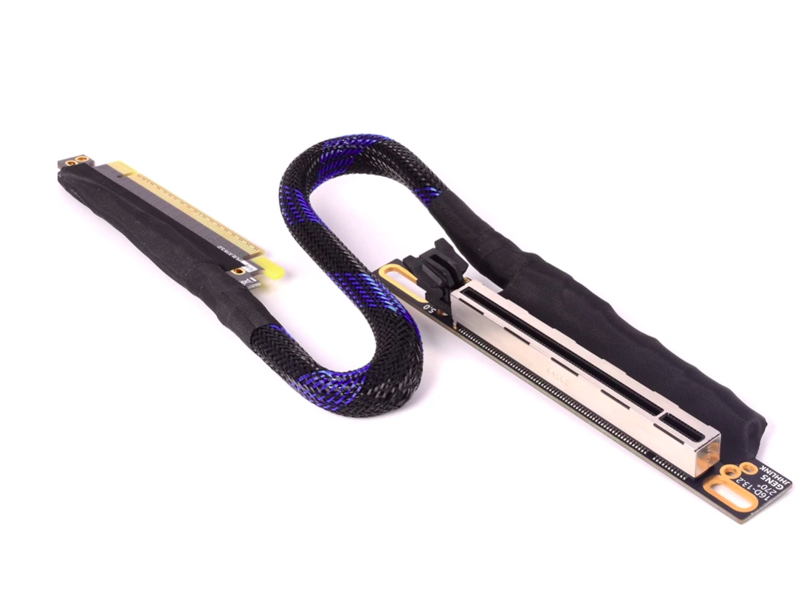 
            <b>11. Fan</b> 
            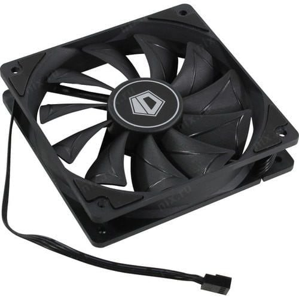 
        </td>
        <td valign="top" align="center" width="50%">
            <b>2. CPU heatsink</b> 
            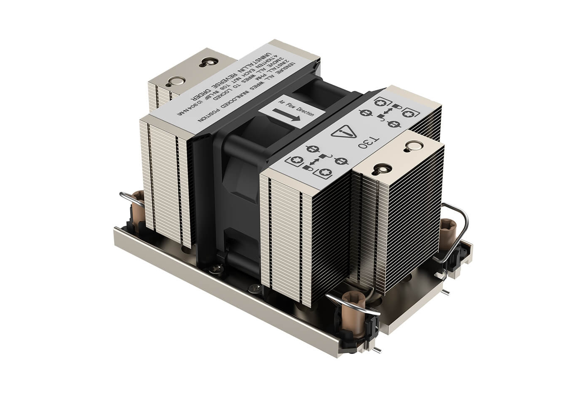 
            <b>4. PSU</b> 
            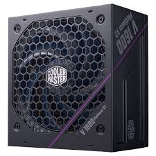 
            <b>6. Power cord</b> 
            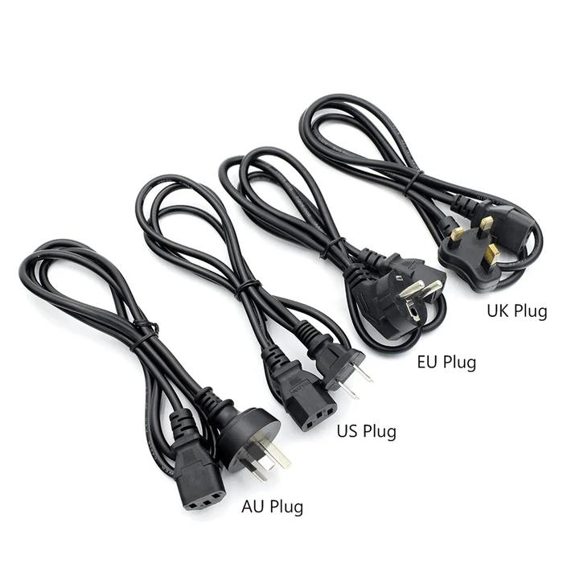 
            <b>8. GPU — NVIDIA RTX PRO 6000 Blackwell</b> 
            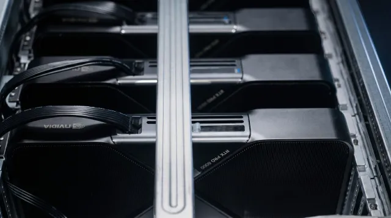 
            <b>10. GPU power cable</b> 
            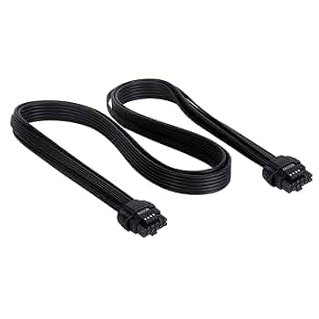 
        </td>
    </tr>
</table>

Next: [assembly](assembly.md).
