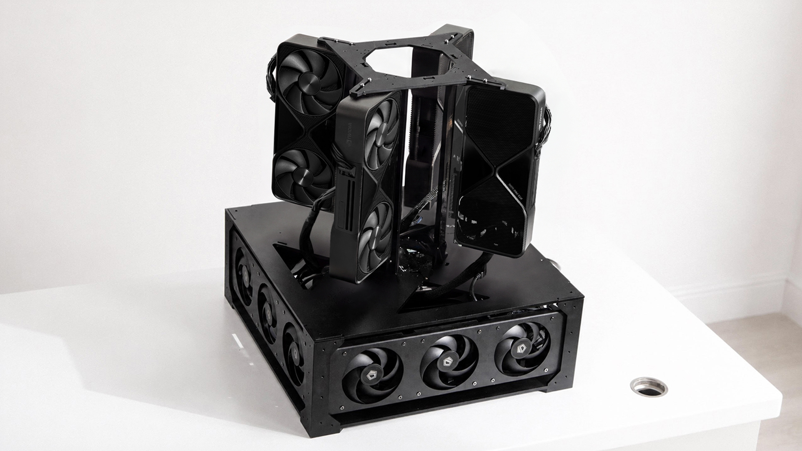
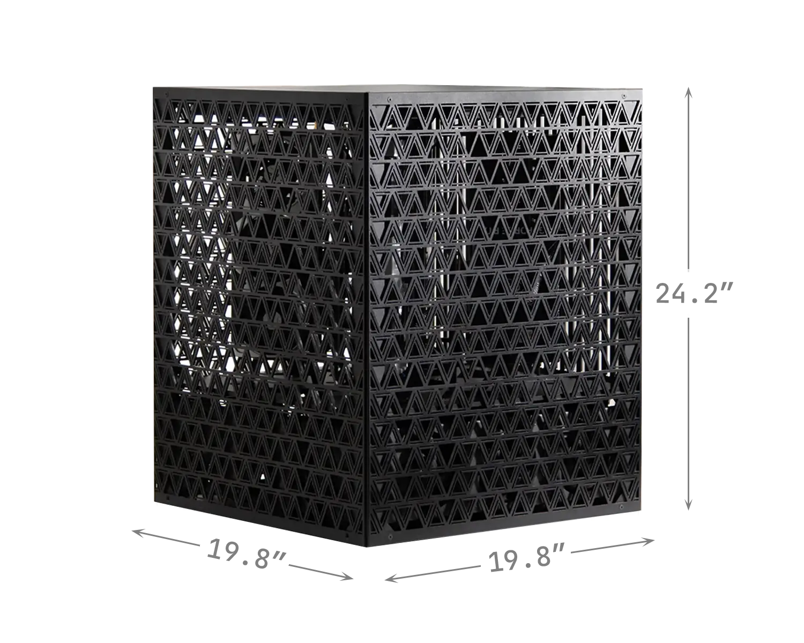
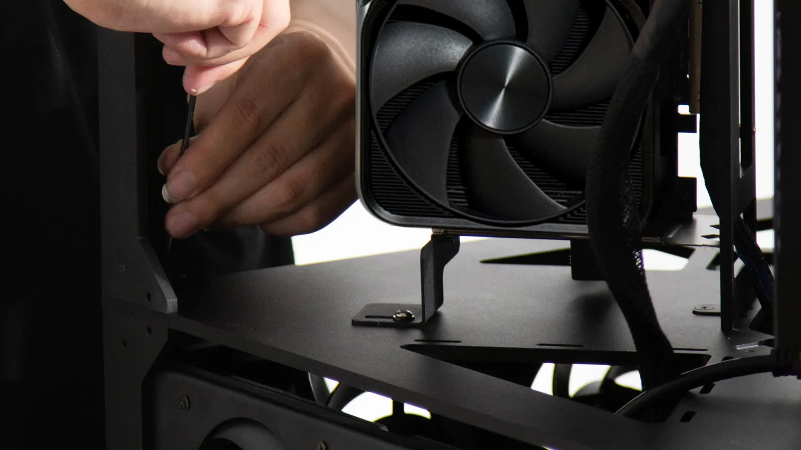
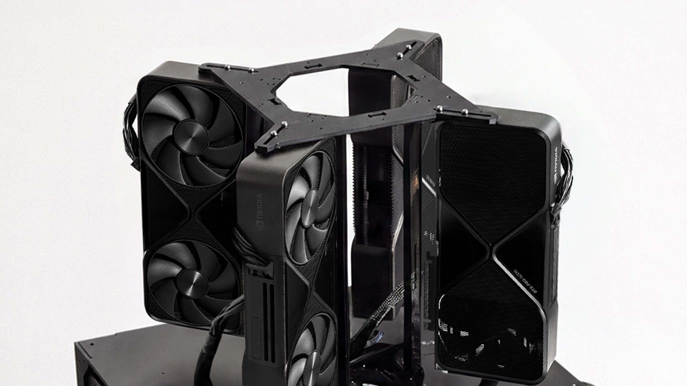
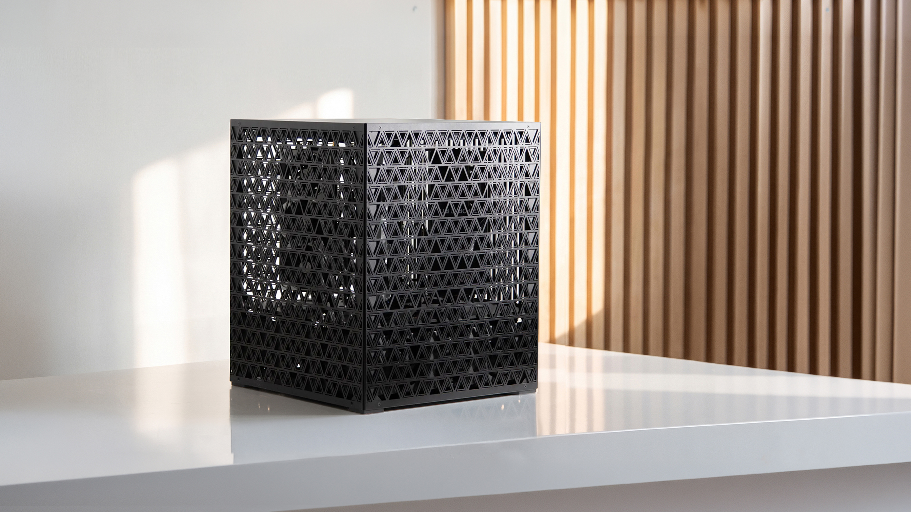
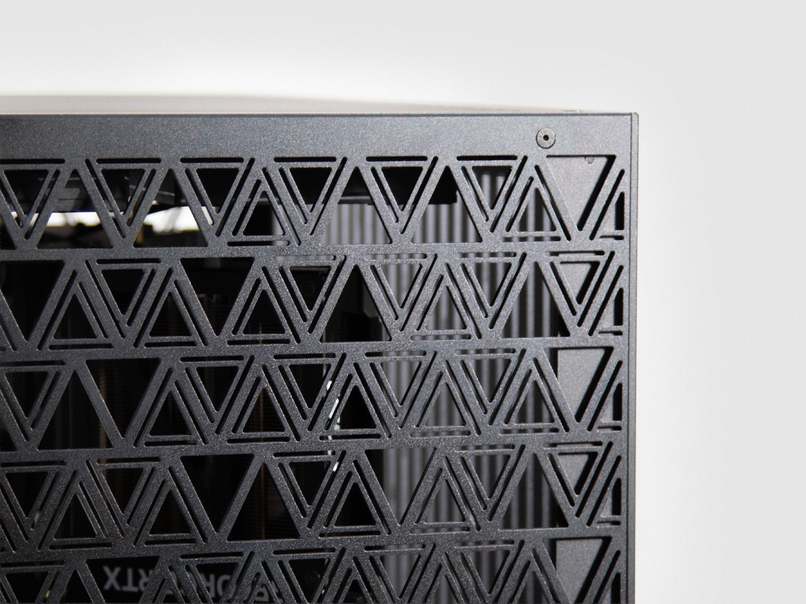

# 4× NVIDIA RTX PRO 6000



The team build, in ECC: four RTX PRO 6000 Blackwell GPUs in a cube housing milled from solid aluminium, on an Intel Xeon W platform. 384 GB of ECC VRAM — fine-tune and serve the biggest open models as released, for a whole team, on a machine that sits in the room with you.

- **4× NVIDIA RTX PRO 6000 Blackwell** — 384 GB GDDR7 ECC · 7,168 GB/s (96 GB per card)
- **Intel Xeon w5-3423** (ASUS Pro WS W790E-SAGE SE) · 192 GB DDR5 ECC · 2 TB NVMe
- **PCIe Gen 5 ×16** per GPU — 112 lanes across seven slots
- **4,000 W** — 2× 2,000 W, native 12V-2×6 · 240 V circuit
- **19.8″ × 19.8″ × 24.2″** · 66 lb



> **Draft guide** — the housing, board and power are confirmed; the step-by-step assembly photos, component photos, and a testing screenshot from this build are landing soon.

## Prefer a finished machine?

Building from this guide is the full DIY path. If you'd rather skip sourcing, CNC, and assembly, we have it covered — [order the 4× 6000 built](https://www.autonomous.ai/computer-4).

## Build it

1. **Parts** — the [bill of materials](bom/bom.md).
2. **Housing** — print the [STL files](../4x-5090/stl-models) or CNC the [STEP files](../4x-5090/step_models); the [housing prep](docs/prepare-me.md) is what to check before anything electronic goes near it.
3. **Lay out the electronics** — every part in the [bill of materials](bom/bom.md). Lay them all out and check them off before you start.
4. **Assemble** — the [step-by-step assembly guide](docs/assembly.md), 23 steps from bare housing to closed box.
5. **BIOS, drivers, testing** — the shared [BIOS tuning and GPU testing](../setup.md) guide. Board-specific notes below.
6. **Serve your models** — [Grid](https://github.com/autonomous-ai/autonomous-grid), the open orchestrator for local AI, or any local AI engine: vLLM, Ollama, llama.cpp.

<table>
<tr>
<td width="50%"></td>
<td width="50%"></td>
</tr>
</table>

## BIOS notes and testing

The 4× runs on an ASUS Pro WS W790E-SAGE SE. The settings that matter (the general list is in [the setup guide](../setup.md)):

```
Advanced -> PCI Subsystems Settings -> Enable Above 4G Decoding
Advanced -> PCI Subsystems Settings -> Enable Re-size BAR support
Set every GPU slot to PCIe Gen 5
```

The w5-3423's 112 PCIe 5.0 lanes are enough to give all four cards a full ×16 link, so nothing has to be bifurcated down — the thing to verify is that no slot has quietly negotiated ×8. For exact menu locations, see ASUS's Pro WS W790E-SAGE SE user guide.

Then make sure all four cards are detected, report full VRAM, and link at full PCIe width — the checklist is in [the setup guide](../setup.md#gpu-testing).

<!-- nvidia-smi screenshot from this build lands here. -->

## Serve your models

The rig runs, now put it to work. The easiest way is [Grid](https://github.com/autonomous-ai/autonomous-grid), the open orchestrator for local AI: it pools your machines into one local AI network. Or run any local AI engine — vLLM, Ollama, llama.cpp.

```bash
curl -fsSL https://grid.autonomous.ai/install.sh | bash
```


## The finished machine

<table>
<tr>
<td width="50%"></td>
<td width="50%"></td>
</tr>
</table>

## Discussion

Alternative platforms weighed on the way to this build — a dual-socket EPYC server variant, single-socket options, and a 3× H100 PCIe alternative — with verification notes: [brainstorm & discussion](docs/discussion.md).

## Other builds

The [2× 5090](../2x-5090/README.md) (start tonight), the [2× 6000](../2x-6000/README.md) (the same cards, desk-sized), the [4× 5090](../4x-5090/README.md) (the team build), and the [8× 5090](../8x-5090/README.md) (on-prem scale) scale the same idea down and up.

## License

Open source under the [MIT License](../LICENSE).
