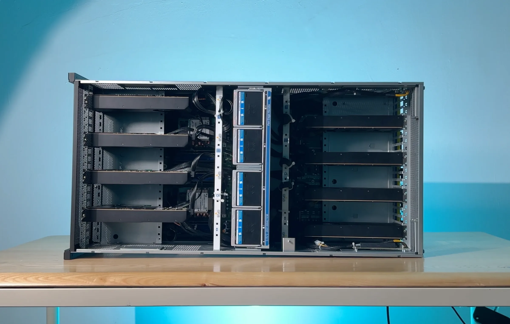
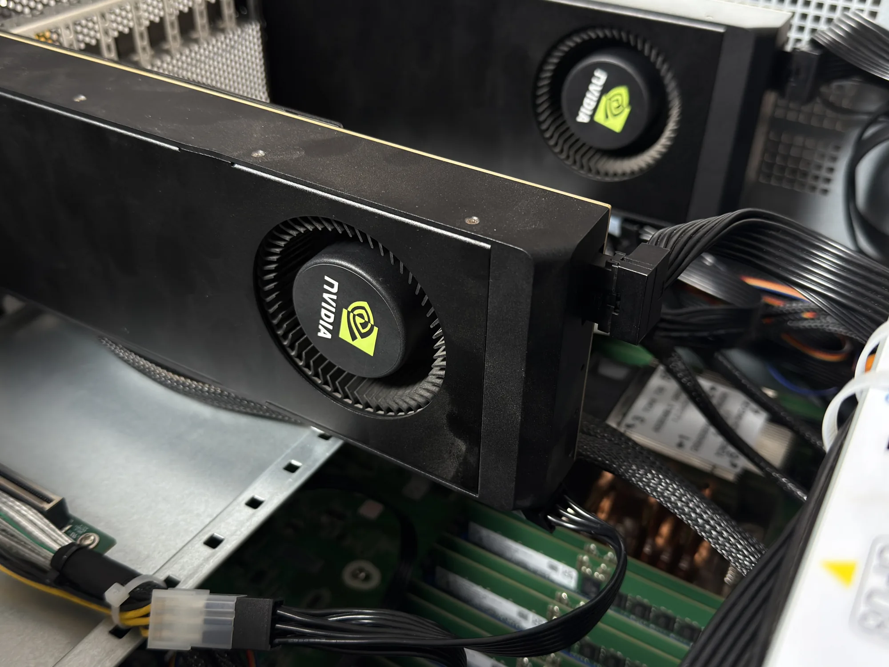
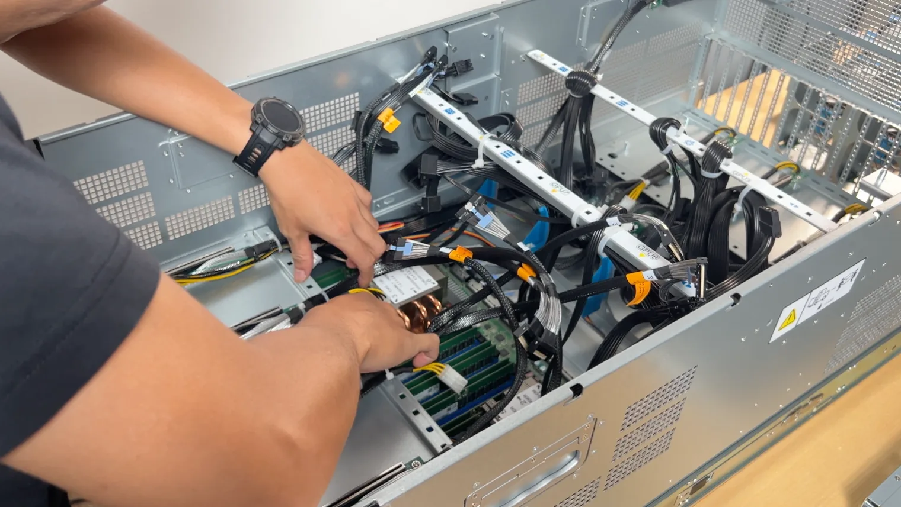
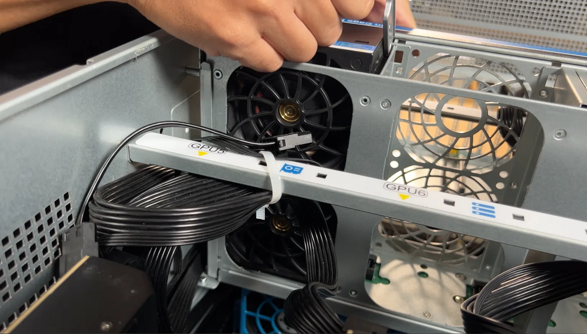
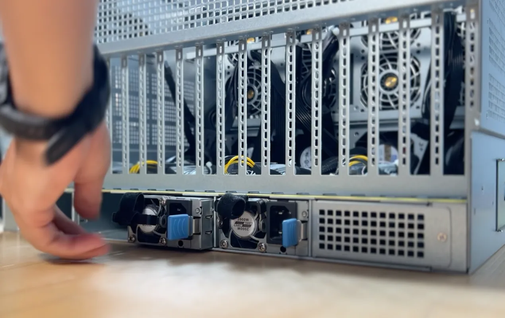

# 8× NVIDIA RTX 5090



The on-prem build, for business: eight GPUs on a dual-EPYC (Genoa) platform in a 5U rack chassis. A team's AI on your own floor, where your IP and data never leave the building.

- **8× NVIDIA RTX 5090** — 256 GB VRAM · 14,336 GB/s · 1,676 FP32 TFLOPS
- **2× AMD EPYC 9004** (ASRock Rack GENOA2D24G-2L+) · 192 GB RAM · 1 TB NVMe
- **PCIe Gen 5 ×16** per GPU, over MCIO · 2× 1 GbE · BMC
- **5,100 W draw** · 8,000 W PSU
- **5U rack chassis**

## Prefer a finished machine?

Building from this guide is the full DIY path. If you'd rather skip sourcing, CNC, and assembly, we have it covered — [order the 8× 5090 built](https://www.autonomous.ai/computer-8).

## Build it

1. **Parts** — the [bill of materials](bom/bom.md).
2. **Housing** — the [5U chassis kit](docs/prepare-me.md) ships complete.
3. **Lay out the electronics** — the [component checklist](docs/prepare-ee.md), with a photo of every part.
4. **Assemble** — the [step-by-step assembly guide](docs/assembly.md), 13 steps from bare chassis to first boot.
5. **BIOS, drivers, testing** — the shared [BIOS tuning and GPU testing](../setup.md) guide. Board-specific notes below.
6. **Serve your models** — [Grid](https://github.com/autonomous-ai/autonomous-grid), the open orchestrator for local AI, or any local AI engine: vLLM, Ollama, llama.cpp.

<table>
<tr>
<td width="50%"></td>
<td width="50%"></td>
</tr>
<tr>
<td width="50%"></td>
<td width="50%"></td>
</tr>
</table>

## Inside the machine

<table>
<tr>
<td width="50%"></td>
<td width="50%"></td>
</tr>
<tr>
<td width="50%"></td>
<td width="50%"></td>
</tr>
</table>

https://github.com/user-attachments/assets/0b51e9fc-8865-4e1a-966e-9ce01fe8d8de

## BIOS notes and testing

The GENOA2D24G-2L+ feeds the GPUs over MCIO, so link width is the setting that matters most (the general list is in [the setup guide](../setup.md)):

```
Advanced -> Chipset Configuration -> PCIE link width
  -> set MCIO2/1, MCIO4/3, MCIO6/5, MCIO8/7, MCIO12/11, MCIO14/13, MCIO16/15, MCIO18/17 to x16
Advanced -> PCI Subsystems Settings -> Enable Re-size BAR support
```

Above 4G Decoding is typically enabled by default on this platform — verify it.

Board references: [motherboard manual](docs/um-motherboard.pdf) · [BMC manual](docs/um-bmc.pdf)

Then make sure all eight cards are detected, report full VRAM, and link at full PCIe width — the checklist is in [the setup guide](../setup.md#gpu-testing).


## Serve your models

The rig runs, now put it to work. The easiest way is [Grid](https://github.com/autonomous-ai/autonomous-grid), the open orchestrator for local AI: it pools your machines into one local AI network. Or run any local AI engine — vLLM, Ollama, llama.cpp.

```bash
curl -fsSL https://grid.autonomous.ai/install.sh | bash
```


## The finished machine


## Other builds

Smaller footprint? The [2× 5090](../2x-5090/README.md) (start tonight), the [2× 6000](../2x-6000/README.md) (desk-sized, 192 GB VRAM), the [4× 5090](../4x-5090/README.md) (the team build), and the [4× 6000](../4x-6000/README.md) (384 GB VRAM) use the same playbook.

This build was previously housed in a CNC-milled desktop tower — those docs and CAD files are kept in [`archive/`](archive).

## License

Open source under the [MIT License](../LICENSE).
