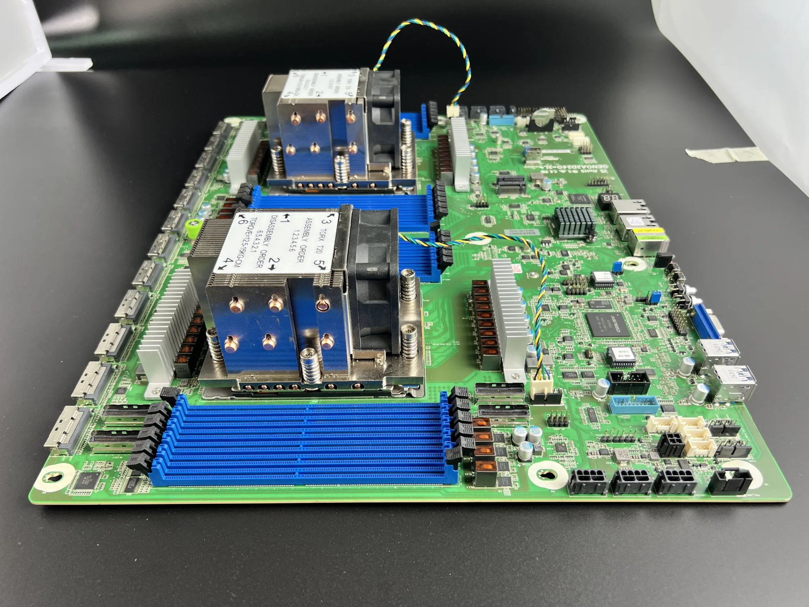
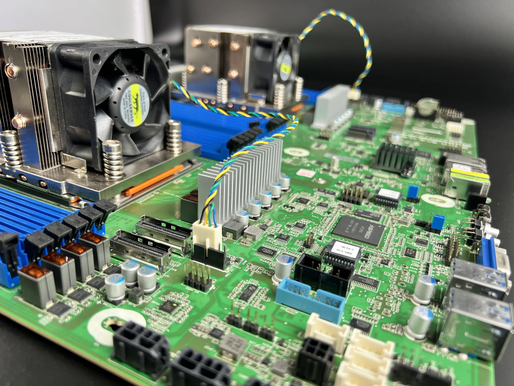
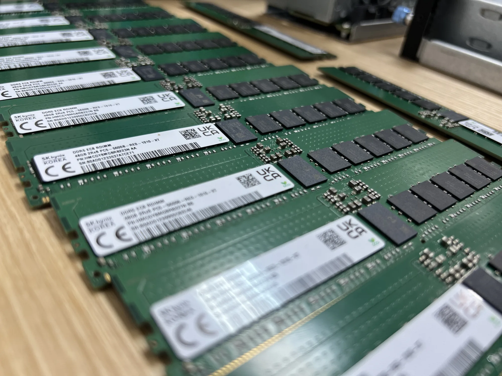
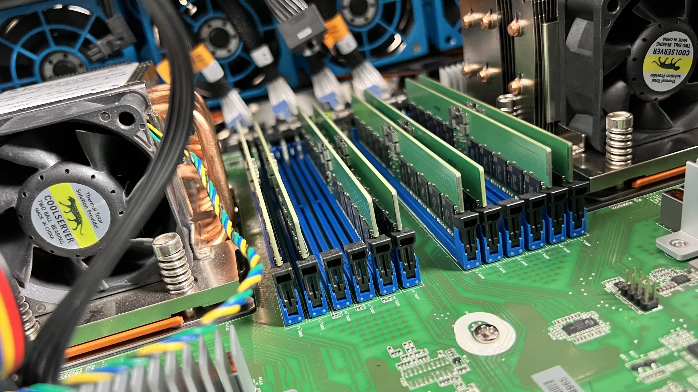
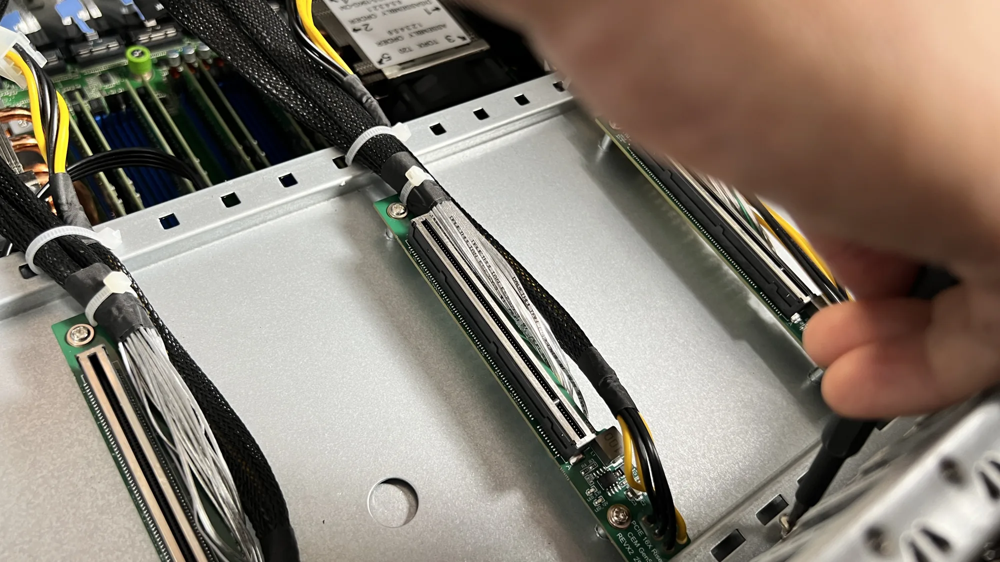
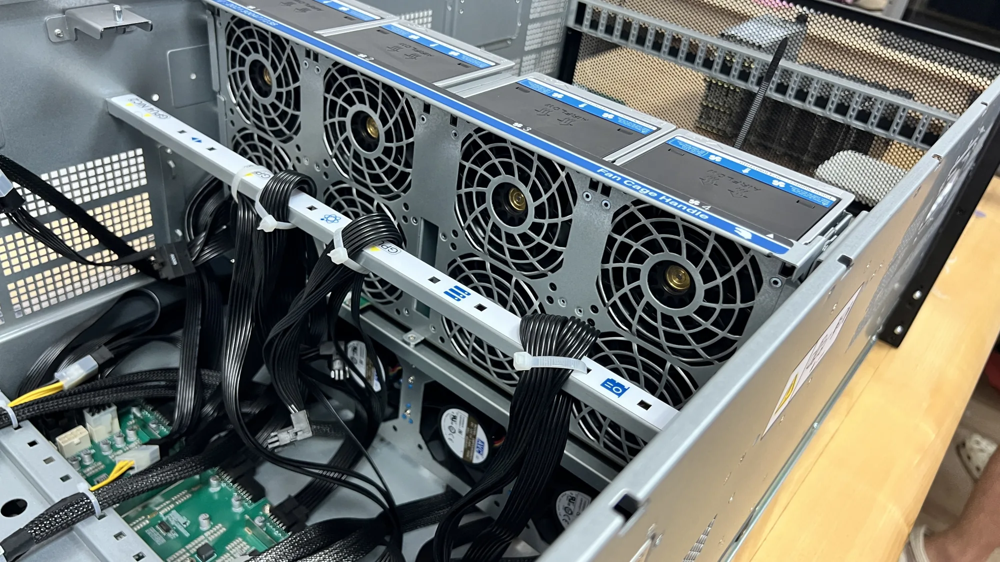
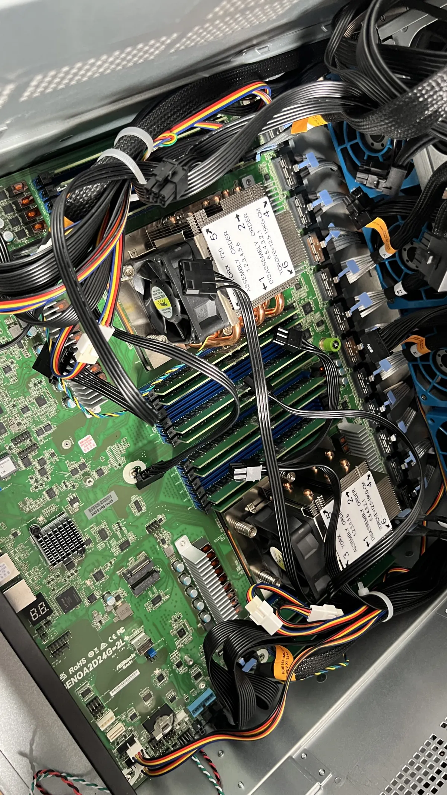
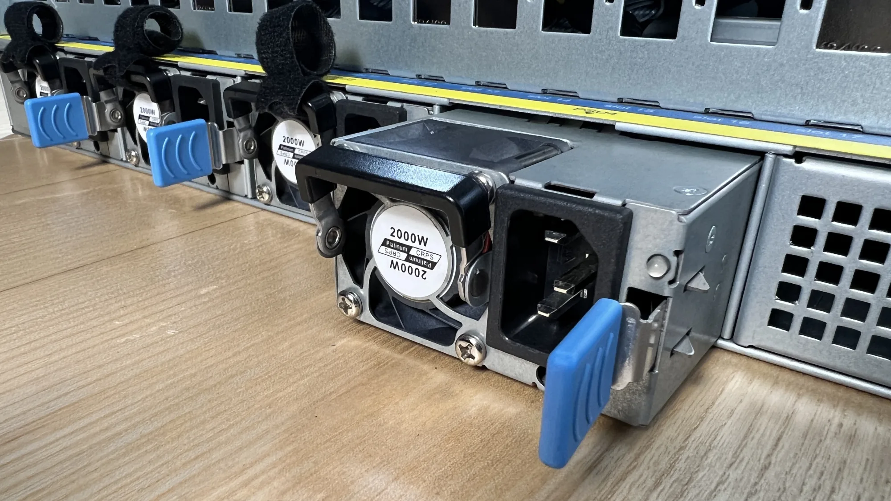
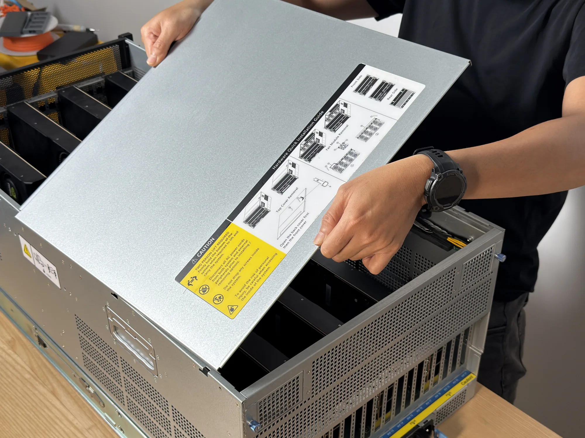

# Assembly

Order of assembly for one 5U server — the GENOA2D24G-2L+ board, two EPYC 9004 CPUs, and eight RTX 5090 GPUs in the 5U rack chassis. Step photos are added as the build is documented.

| Step | Description | Image |
|:----:|:------------|:------|
|  1   | Work through the [component checklist](prepare-ee.md) and lay every part out on the build desk. | |
|  2   | Seat the motherboard in the chassis and secure it with the standoffs and screws. | |
|  3   | Connect the power button and the front-panel wiring to the motherboard headers. | |
|  4   | Install both CPUs into the SP5 sockets, then mount the CPU heatsinks. |   |
|  5   | Populate the DDR5 ECC RDIMMs, following the board's DIMM population order. |   |
|  6   | Connect the MCIO cables to the motherboard — two per GPU (x16 = 2× x8). | |
|  7   | Install the HDD bay and the drive panel. | |
|  8   | Mount the MCIO→PCIe x16 adapters onto the chassis mounts — one per GPU slot. |  |
|  9   | Install the eight RTX 5090 GPUs and secure each one. | |
|  10  | Install the front and rear fan blocks, then connect them to the motherboard. |   |
|  11  | Install the CRPS PSUs and connect them to the power board. |  |
|  12  | Power on and test — all eight cards detected, full VRAM, full PCIe link width. See [the setup guide](../../setup.md#gpu-testing). | |
|  13  | Fit the top cover and close the chassis for the rack. Two-person lift — the back cover goes on before the front. |  |

---
